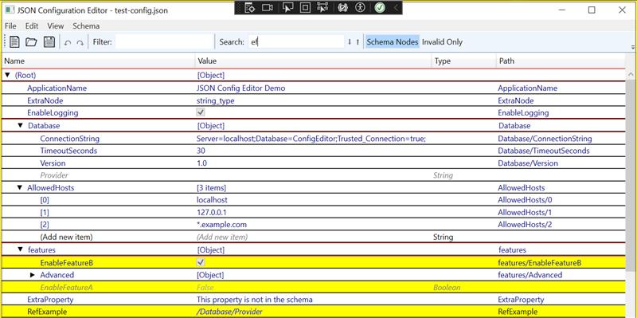

# **JSON Configuration Editor**

This project is a sophisticated WPF-based editor designed for viewing, editing, and managing complex, layered JSON configuration files. It moves beyond simple text editing by representing JSON data as a structured Document Object Model (DOM) and leveraging C# class definitions for powerful, schema-driven validation, editing, and UI hints.



The editor's primary goal is to provide an intuitive and robust interface for handling enterprise-level configurations, where settings are often inherited and overridden across multiple environments (e.g., base, staging, production). It unifies single-file editing and multi-layer project management into a single, consistent workflow.

## **Core Features**

* **Cascade Project Mode**: The editor's main strength is its ability to manage "Cascade Projects." It loads multiple configuration folders as layers, merges them according to a defined precedence, and clearly shows the origin of every value.  
* **Schema-Driven from C#**: Instead of relying on separate JSON Schema files, the editor derives its schema, validation rules, default values, and read-only states directly from C# class definitions and attributes found in scanned assemblies.  
* **Advanced DataGrid UI**: Configurations are displayed in a flattened, two-column grid that supports indentation for hierarchy, expand/collapse for objects and arrays, and virtualization for performance.  
* **Context-Aware Validation**: Schema validation is intelligently applied. In a merged view, all rules (including "missing required field") are enforced to give a true health check. In a layer-specific view, "missing required" errors are ignored to reduce noise and allow for sparse override files.  
* **Rich Editing Experience**:  
  * Full undo/redo support for all data-modifying operations.  
  * Context menus provide layer-aware actions like "Reset to undefined" (to remove an override) and "Override Sources" (to see which layers define a value).  
  * Placeholder nodes for schema-defined properties that are not yet present in the data can be materialized with a single action.  
* **Symbolic Reference ($ref) Support**: The editor fully supports $ref nodes for creating symbolic links to other values within the static configuration, complete with cycle detection and "jump to definition" navigation.  
* **Powerful Search & Filter**:  
  * A "Search and Reveal" filter instantly shows matching nodes and all their parents.  
  * Standard search finds the final, effective values in the current view.  
  * A project-wide "Search All Layers" audit tool finds every occurrence of a term across all files, including masked/overridden values.  
* **Project Auditing**: An on-demand "Integrity Check" tool scans the entire project for inconsistencies like property name casing mismatches or misaligned file paths across layers.

## **Key Concepts**

### **Unified Cascade Model**

The editor treats every scenario as a cascade. A single JSON file is simply a two-layer project: the schema-defined defaults (Layer 0) and the file's content (Layer 1). A full cascade project adds more layers, but the underlying logic remains the same. This unified model ensures all features are available in all contexts.

### **Layered Configuration**

* **Cascade Layer**: A folder containing one or more .json files. Files within a single layer cannot define the same property at the same path, ensuring a clear origin for every value within that layer.  
* **Intra-Layer Merge**: On loading, all files within a layer are merged into a single DOM tree for that layer.  
* **Inter-Layer Merge**: To display the final configuration, layers are merged in order of precedence. Objects are deep-merged, while arrays and primitive values from higher-priority layers completely replace those from lower layers.

### **Runtime vs. Edit-Time Architecture**

The system is designed to support a hybrid workflow where editable JSON configurations are used to generate a fast, pre-resolved runtime format.

* **Editing**: The editor works with raw JSON(5) files, preserving $ref nodes and providing rich schema-driven assistance.  
* **Runtime Build**: The editor can export the final, merged configuration into a compact BSON file. During this export, all $ref nodes are resolved, and default values from the schema are injected. This ensures the runtime application loads a complete, fast, and pre-validated configuration without needing to perform its own parsing, merging, or validation.

This separation of concerns allows the editor to be powerful and feature-rich, while the runtime remains lean and performant.

## **Using RuntimeConfig.Core in Your Application**

The RuntimeConfig.Core library is a lightweight, powerful engine for consuming the layered configurations created by the editor. It allows your application to load multiple JSON sources, merge them according to a defined hierarchy, and query the final, effective values in a simple and strongly-typed way.

### **1. Defining Configuration Layers**

First, define the layers of your configuration. Each layer is represented by a LayerDefinition record, which contains a name and the path to its folder. The order of this list is crucial, as it determines the override precedence (from lowest to highest).

``` csharp
using RuntimeConfig.Core.Models;  
using System.Collections.Generic;  
using System.IO;

// Define the layers for your application  
var layers = new List<LayerDefinition>  
{  
    new LayerDefinition("Base", Path.Combine("config", "1_base")),  
    new LayerDefinition("Staging", Path.Combine("config", "2_staging")),  
    new LayerDefinition("Production", Path.Combine("config", "3_production"))  
};
```

### **2. Setting Up the Provider and DOM Tree**

Next, instantiate the CascadingJsonProvider with your layer definitions. This provider is then registered with a RuntimeDomTree instance, which orchestrates the loading and querying process. You can mount your provider at a specific path (e.g., "app") to namespace your configuration.

``` csharp
using RuntimeConfig.Core;  
using RuntimeConfig.Core.Providers;

// Create the provider with the defined layers  
var provider = new CascadingJsonProvider(layers);

// Create the main DOM tree and register the provider  
var configTree = new RuntimeDomTree();  
configTree.RegisterProvider("app", provider);
```

### **3. Loading and Refreshing the Configuration**

Before you can query for values, you must load and merge the configuration from all the layers. This is done asynchronously.

``` csharp
// Asynchronously load and resolve the configuration from all layers  
await configTree.RefreshAsync();
```

### **4. Querying Configuration Values**

Once the tree is refreshed, you can query for values using a simple, path-based syntax. The paths are constructed from the mount point, the file names (without the .json extension), and the property keys within the files.

The generic Get<T>() method automatically deserializes the value to your desired C# type.

``` csharp
// Get a query object from the loaded tree  
DomQuery query = configTree.Query();

try  
{  
    // Read whole config to an in-memory class instance (this class is also used as a schema
    // definition for the editor - editor load it dynamically from this app assembly.)
    var appSettings = query.Get<JsonConfigEditor.TestData.AppConfiguration>("app/app-settings");
    Console.WriteLine($"App name from config: {appSettings.ApplicationName}");

    // Query for a string value from app-settings.json  
    // Path: {mount-point}/{file-name}/{property-name}  
    string appName = query.Get<string>("app/app-settings/ApplicationName");

    // Query for an integer value  
    int port = query.Get<int>("app/app-settings/Port");

    // Query for an array of strings  
    string[] allowedHosts = query.Get<string[]>("app/app-settings/AllowedHosts");

    // Query for a nested value from services/Auditing.json  
    int retention = query.Get<int>("app/services/Auditing/RetentionPeriod");

    Console.WriteLine($"Application Name: {appName}");  
    Console.WriteLine($"Port: {port}");  
    Console.WriteLine($"Allowed Hosts: {string.Join(", ", allowedHosts)}");  
    Console.WriteLine($"Audit Retention: {retention} days");  
}  
catch (KeyNotFoundException ex)  
{  
    Console.WriteLine($"Configuration error: {ex.Message}");  
}
```

The library handles the complexity of the cascade, ensuring that the value you receive is always the one from the highest-priority layer that defines it. For example, if Port is defined in both the "Base" and "Production" layers, the query will correctly return the value from the "Production" layer.

## **Defining and Using a Custom Schema**

The editor's most powerful feature is its ability to derive a validation schema directly from your C# classes. This allows you to define your configuration's structure, data types, default values, and validation rules in one place.

### **1. Creating the Schema Classes**

In a separate .NET class library project, define your configuration structure using plain C# classes. Use attributes to provide metadata for the editor.

* **[ConfigSchema(mountPath, type)]**: Marks a class as a root of a schema. The mountPath tells the editor where in the DOM this schema applies. Use "$root" for the main configuration object.  
* **[Range(min, max)]**: For numeric properties, enforces minimum and maximum values.  
* **[SchemaAllowedValues(...)]**: For string properties, provides a list of valid options, which the editor will display as a dropdown.  
* **Property Initializers**: C# property initializers (e.g., public int TimeoutSeconds { get; set; } = 30;) are used as the default values in the editor.

**Example (SampleSchemas.cs):**

``` csharp
using RuntimeConfig.Core.Schema.Attributes;  
using System.ComponentModel;  
using System.ComponentModel.DataAnnotations;

// The root of our configuration schema, mounted at "$root"  
[ConfigSchema("$root", typeof(AppConfiguration))]  
public class AppConfiguration  
{  
    public string ApplicationName { get; set; } = "Default App";

    [Range(1, 65535)]  
    public int Port { get; set; } = 8080;
    
    public bool EnableLogging { get; set; } = true;
    
    public DatabaseSettings Database { get; set; } = new();  
}

// A nested object within the configuration  
public class DatabaseSettings  
{  
    [SchemaAllowedValues("SqlServer", "PostgreSQL", "MySQL")]  
    public string Provider { get; set; } = "SqlServer";

    public string ConnectionString { get; set; } = "";
    
    [Range(1, 3600)]  
    public int TimeoutSeconds { get; set; } = 30;
    
    [ReadOnly(true)]  
    public string Version { get; set; } = "1.0";  
}
```

### **2. Pointing the Editor to Your Schema**

After compiling your schema library, you need to tell the editor where to find it. This is done in the .cascade.jsonc project file.

Create a schemaSources array and provide the path to the folder containing your compiled schema assembly (.dll).

**Example (test-project.cascade.jsonc):**

``` json
{  
  "schemaSources": [  
    "../YourSchemaProject/bin/Debug/net8.0"  
  ],  
  "layers": [  
    {  
      "name": "Base",  
      "folderPath": "config/1_base"  
    },  
    {  
      "name": "Production",  
      "folderPath": "config/3_production"  
    }  
  ]  
}
```

When you open this project file in the editor, it will automatically:

1. Scan the assemblies in the schemaSources path.  
2. Discover the [ConfigSchema] attributes and build the entire schema tree in memory.  
3. Apply the validation rules, default values, and UI hints to the configuration files as you edit them.
4. 